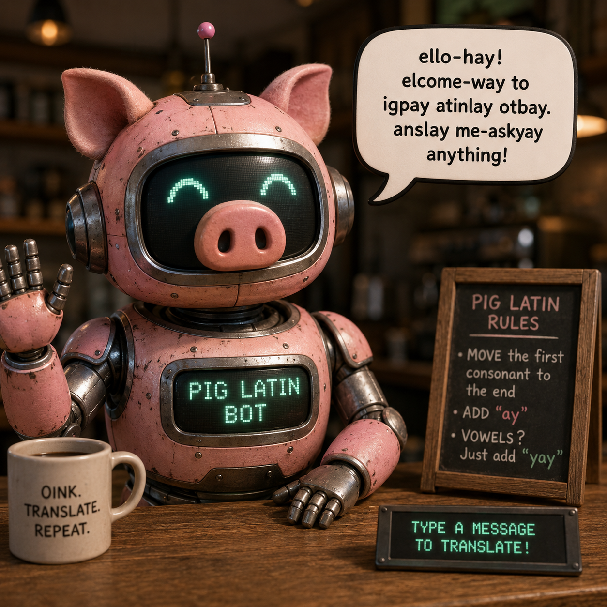
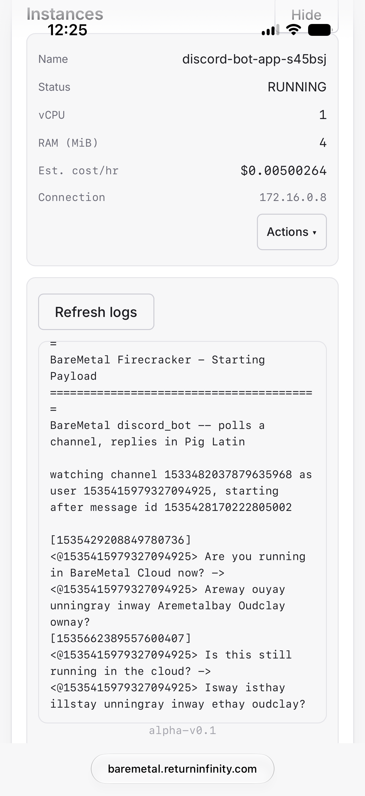
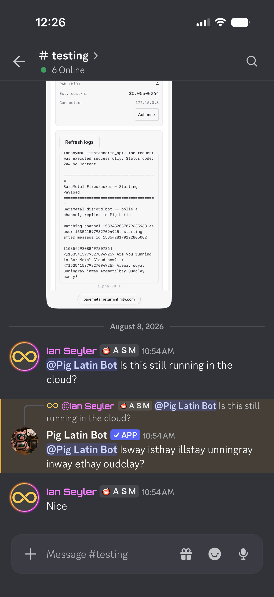

# BareMetal-Discord-Bot



*Image generated by ChatGPT - it dropped the ball at the end of the speech bubble.*

A simple Discord bot that watches one channel and replies with a Pig Latin
translation of any human message that directly `@mentions` it.

Runs as an ordinary `*nix` program, and on [BareMetal](https://github.com/ReturnInfinity/BareMetal) -
an operating system built to run a single, statically-linked C program directly
on hardware (or a microVM) with no OS overhead in between.

## Why this exists

Most Discord bots assume a full OS, a language runtime, a garbage collector,
and hundreds of megabytes of headroom for good measure. This one doesn't.
Every buffer in `discord_bot.c` is static and fixed-size - nothing is
`malloc`'d - specifically so it can run in a **RAM-constrained** environment.

In a world where "small" usually still means a few hundred MiB, this bot has
been tested running successfully end-to-end, polling Discord and posting
replies, inside a **4MiB [Firecracker](https://firecracker-microvm.github.io/) microVM**
on [BareMetal Cloud](https://baremetal.returninfinity.com):



And here it is replying in the wild, in an actual Discord channel:



## How it works

- **Polling, not the Gateway.** A "real" Discord bot normally holds a
  persistent WebSocket open to Discord's Gateway and gets pushed
  `MESSAGE_CREATE` events. That's not available here - the BareMetal-App
  `curl` port this is built against has WebSockets compiled out (HTTP/HTTPS
  only). So instead this polls `GET /channels/{id}/messages` every
  `POLL_INTERVAL_SECS`, using `after` to only ask for messages newer than the
  last one it already handled, and replies via `POST /channels/{id}/messages`
  - both ordinary HTTPS requests through libcurl.
- **`@mention` gating.** On startup the bot looks up its own user id via
  `GET /users/@me`, then only replies to a message whose raw content contains
  a literal `<@id>` or `<@!id>` for that id. Everything else (`@everyone`,
  role mentions, plain messages) is ignored.
- **Hand-rolled JSON.** There's no JSON library here - `json_extract_string()`
  / `json_extract_object()` / `split_json_objects()` do just enough parsing
  for this shape of Discord response, tracking string/escape state and
  brace/bracket depth so nested objects (like a reply's
  `referenced_message`, or a mentioned user's own `"id"`) can't be mistaken
  for the outer message's fields.
- **Pig Latin rules.** A leading vowel run gets `"way"` appended; otherwise
  the leading consonant cluster (a trailing `"qu"` counts as part of it, so
  "queen" -> "eenquay", not "ueenqay") moves to the end plus `"ay"`; a word
  with no vowels just gets `"ay"`. Only the first letter's case survives
  (ALL-CAPS input comes back Titlecase). Discord mentions/channels/emoji
  (`<@id>`, `<#id>`, `<:name:id>`) and `http(s)://` URLs are passed through
  untouched so translating them can't break a real ping or a working link.

## Build instructions

### BareMetal

```sh
git clone https://github.com/ReturnInfinity/BareMetal-App
cp discord_bot.c BareMetal-App/
cd BareMetal-App
./setup.sh
./1-build.sh discord_bot.c
./2-run.sh
./3-upload.sh   # optional - upload to BareMetal Cloud
```

### *nix (Linux/BSD/macOS)

`discord_bot.c` is also a valid standalone C program - just link it against
libcurl:

```sh
gcc -O2 -o discord_bot discord_bot.c -lcurl
./discord_bot
```

## Discord setup

1. Create an application + bot at the
   [Discord Developer Portal](https://discord.com/developers/applications).
2. Copy the bot token into `DISCORD_BOT_TOKEN` in `discord_bot.c`.
3. On the **Bot** tab, enable the **Message Content Intent** toggle - without
   it, Discord redacts the `content` field (returns `""`) on every message
   this bot didn't send itself, for both the Gateway and this REST endpoint.
4. Invite the bot to a server with the `bot` scope and the
   **Read Messages/View Channel** + **Send Messages** permissions.
5. With Developer Mode enabled in Discord, right-click the target channel ->
   **Copy Channel ID** -> set `DISCORD_CHANNEL_ID` in `discord_bot.c`.

`main()` refuses to run with either value left empty. Both are per-bot
secrets, so don't commit real values into a shared/example file.

## Notes

- **TLS verification is off.** `CURLOPT_SSL_VERIFYPEER`/`VERIFYHOST` are
  both disabled since no CA store is vendored on the BareMetal-App `curl`
  port. TLS still buys confidentiality on the wire, just not server-identity
  assurance - acceptable for hitting one known-good public endpoint, but the
  bot token is a bearer credential regardless, so treat it like a password.
- **No message loss across polls, only latency.** `after` always advances to
  the newest message id seen, so a burst larger than `MAX_MSG_OBJS` just
  finishes over the next poll or two rather than dropping anything.
- **Memory footprint.** All buffers are static and sized generously relative
  to Discord's own limits (e.g. `CONTENT_MAX` leaves headroom under Discord's
  2000-character cap) while still fitting comfortably inside a 4MiB microVM.

## License

MIT - see [LICENSE](LICENSE).
